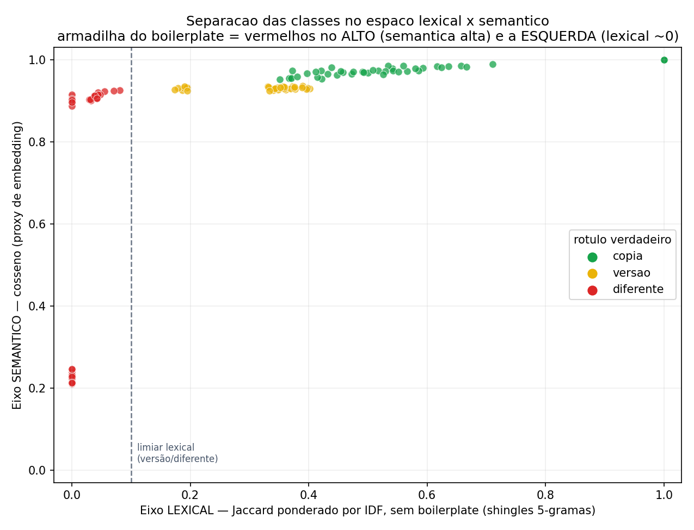

# Questão 1 — Similaridade entre documentos jurídicos (validação em código)

Protótipo executável que **valida a solução desenhada para a Questão 1**: detectar
quando dois documentos de um mesmo caso são *cópia*, *versão modificada* ou
*documento diferente*, sem ser enganado pelo vocabulário jurídico compartilhado.

**Autor:** Guilherme Holanda Marques

> **Transparência:** este protótipo foi escrito em *vibe coding* com o modelo
> **Claude Opus 4.8** . O código é totalmente executável e
> testado — a intenção é validar empiricamente as ideias de design.

A tese central que o código comprova:

> Similaridade não é um eixo só. Medir **semântica/vocabulário** (o que embeddings
> fazem) confunde "documentos quase iguais" com "documentos que só usam o mesmo
> jargão jurídico". É preciso um segundo eixo **lexical** (sobreposição de
> sequências reais de texto, com o boilerplate removido) para desfazer a confusão.

```bash
pip install -r requirements.txt
python main.py          # roda a validação completa (~5 s) e gera results/
pytest -q               # testes de invariantes do núcleo
```

---

## A cascata (mapeada 1:1 com a resposta escrita)

| Tier | O que faz | Onde no código | Custo |
|------|-----------|----------------|-------|
| **0 — Hash exato** | SHA-256 do texto normalizado → cópia idêntica | `fingerprint.Document.sha256` | ~0 |
| **1 — MinHash/LSH** | recupera candidatos dentro do mesmo caso | `minhash_lsh.py`, `SimilarityIndex.candidates_same_case` | baixo |
| **2 — Score 2 eixos** | Jaccard ponderado por IDF (lexical, **sem boilerplate**) + cosseno (semântico) + edit ratio → classifica a maioria | `lexical.py`, `semantic.py`, `pipeline.classify` | médio |
| **3 — LLM no diff** | só os pares na **faixa de incerteza** (semântica alta + lexical na fronteira versão/diferente) | `pipeline.needs_llm` (roteamento; a chamada ao LLM é o passo de produção) | alto |

O eixo lexical opera sobre **shingles distintivos**: shingles que aparecem em mais
de 15% do corpus são tratados como boilerplate jurídico e removidos antes do
Jaccard (o "stopword corpus" descrito na resposta). É isso que derruba a armadilha.

---

## Resultados (reproduzíveis, `seed` fixa)

Corpus sintético: **40 casos, 240 documentos, 200 pares rotulados**, split 100/100
por caso (sem vazamento treino→teste). Limiares calibrados por busca em grade no
treino, avaliados no teste.

**Comparação de modelos (held-out, 1 split):**

| Modelo | macro-F1 | acurácia | falso merge¹ |
|--------|:--------:|:--------:|:------------:|
| **2 eixos (lexical + semântico)** | **1.000** | **1.000** | **0.0%** |
| baseline só-semântica (cosseno) | 0.976 | 0.980 | 5.0% |
| baseline só-lexical (Jaccard IDF) | 0.964 | 0.970 | 2.5% |

**Robustez em 5 seeds (média ± desvio):**

| Modelo | macro-F1 | falso merge¹ |
|--------|:--------:|:------------:|
| **2 eixos** | **0.985 ± 0.014** | 1.5% ± 2.0% |
| só-semântica | 0.983 ± 0.012 | 2.0% ± 1.9% |
| só-lexical | 0.949 ± 0.029 | 1.0% ± 1.2% |

¹ *falso merge* = % de documentos **diferentes** classificados como cópia/versão (o erro caro).

Cada eixo sozinho tem uma fraqueza característica, e o modelo de 2 eixos as cobre:

- **Só-semântica** tem o **maior falso merge** — é enganada pela armadilha do
  boilerplate (vê dois documentos da mesma área como muito similares).
- **Só-lexical** é conservadora (falso merge baixo) mas tem o **menor F1** — perde
  versões reescritas, cujo texto literal diverge.
- **2 eixos** combina as duas: melhor F1 geral mantendo falso merge baixo.

**Estágio de candidatos (Tier 1, MinHash/LSH):** recall de **100%** dos pares
cópia/versão.

**Economia da cascata (no teste):** 20% resolvidos só por hash, **98% decididos
sem LLM com 100% de acurácia**, e apenas **2% roteados ao LLM** (Tier 3) — a faixa
de incerteza onde versões muito reescritas e documentos diferentes da mesma área
se confundem. Esse é o trade-off custo×precisão da resposta, quantificado.

### A armadilha do boilerplate, medida

Documentos **diferentes, mas da mesma área jurídica** (mesmo boilerplate, mesmo
vocabulário, fatos distintos):

| par | cosseno (semântico) | Jaccard distintivo (lexical) | 2-eixos | só-semântica |
|-----|:---:|:---:|:---:|:---:|
| c000 → diff | 0.91 | 0.00 | **diferente** ✅ | diferente |
| c001 → diff | 0.93 | 0.08 | **diferente** ✅ | *versao* ❌ |
| c002 → diff | 0.91 | 0.00 | **diferente** ✅ | diferente |

A semântica desses pares (~0.9) está **na mesma altura de versões e cópias** — veja
`results/scatter.png`: os pontos vermelhos no topo-esquerda. Um limiar semântico
(linha horizontal) não os separa; o limiar lexical (linha vertical) separa.



---

## Honestidade sobre o que isto é e não é

- **Dados sintéticos.** O corpus é gerado (não há dados reais de cliente). Ele foi
  construído para conter os casos difíceis de propósito — em especial a armadilha
  do boilerplate — não para inflar números. O `seed` é fixo e o teste é held-out.
- **O eixo semântico é um proxy.** Uso cosseno de *term-frequency* (sem IDF), de
  propósito: ele reproduz o modo de falha dos **embeddings densos** — não fazem
  down-weighting de termos, então linguagem jurídica compartilhada infla a
  similaridade. (TF-**IDF** mascararia a armadilha, pois o próprio IDF derrubaria o
  boilerplate; embeddings reais **não** fazem isso.) Em produção troca-se
  `semantic.SemanticModel` por embeddings de sentença (ex.: multilingual MiniLM) —
  é a única dependência do pipeline, troca de uma linha.
- **A faixa de incerteza é real.** Uma versão fortemente reescrita e um documento
  diferente da mesma área podem ocupar a mesma região (semântica alta, lexical
  baixa). Nenhum sinal barato resolve isso com confiança — por isso a cascata
  reserva o LLM (Tier 3) para esses ~2%.
- **Documentos longos:** todo o cálculo dos Tiers 0–2 é por shingle/vetor e não
  precisa do documento inteiro num LLM; o chunking por seção está esboçado em
  `fingerprint.split_sections`.

---

## Mapa dos arquivos

```
main.py                 # orquestra: gera corpus, calibra, avalia, robustez, plota
src/
  normalize.py          # normalização (OCR, cabeçalho/rodapé, espaços)
  fingerprint.py        # SHA-256, shingles, IDF, seções, Document
  minhash_lsh.py        # MinHash + LSH banding (sem dependências)
  lexical.py            # Jaccard, Jaccard ponderado por IDF, edit ratio
  semantic.py           # eixo semântico (proxy de embedding) — pluggable
  dataset.py            # gerador do corpus jurídico sintético rotulado
  pipeline.py           # a cascata + classificador 2 eixos + calibração + roteamento LLM
  evaluate.py           # métricas, baselines, recall do LSH
tests/test_pipeline.py  # invariantes (armadilha do boilerplate, MinHash≈Jaccard, IDF, hash)
results/                # metrics.json + scatter.png (gerados)
```
